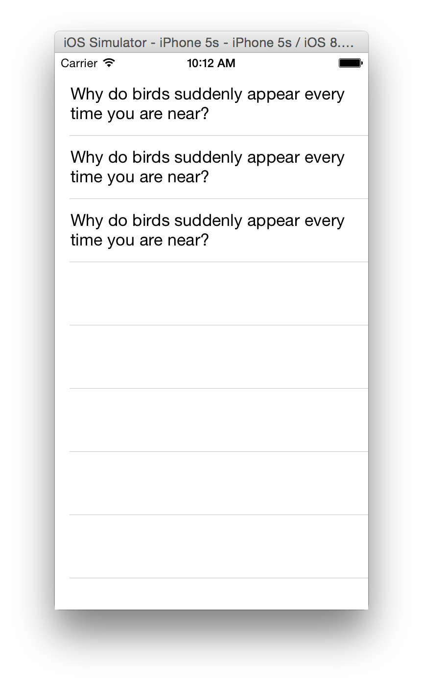
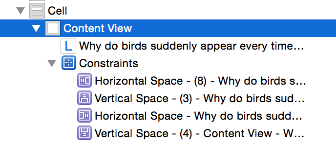
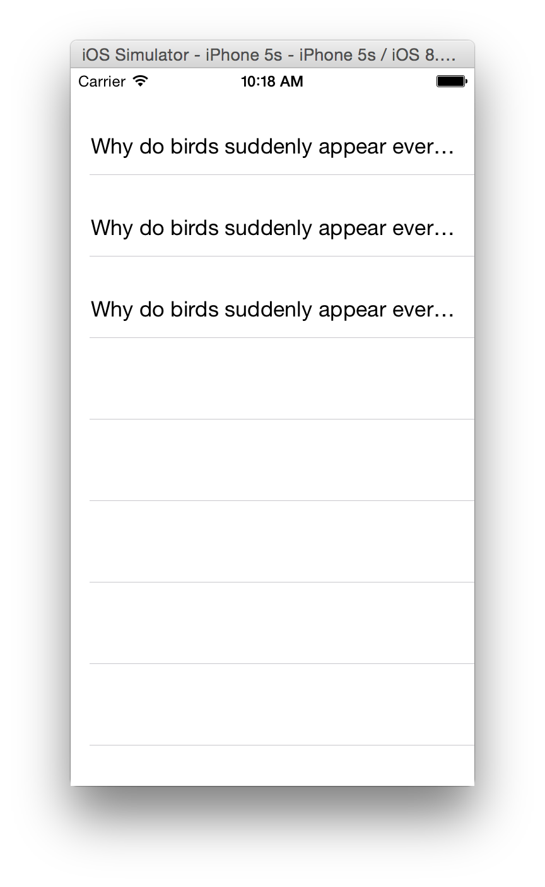
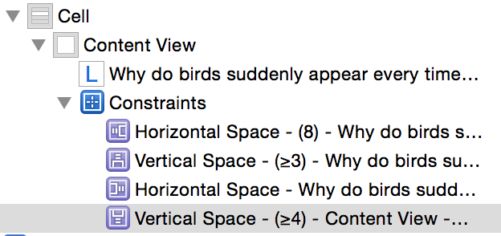

# GreaterThanLabel

A sample indicating how automatic cell height calculation is correct, but layout is incorrect, if the top/bottom constraints are `>=` instead of `==`

## Baseline

Using `estimatedRowHeight` and `rowHeight = UITableViewAutomaticDimension` to configure a `UITableViewCell` to self-size to the correct height is fairly straightforward.

This cell is configured with the horizontal and vertical space constraints to the label being equal (`==`) to a constant value.

## Erroneous Layout

If **one or more** of the vertical space constraints between the cell's Content View and the Label are changed to greater than or equal (`>=`) the cell height calculation appears correct, however the label itself is not layed out correctly (the text does not wrap).

## Expectation

Using greater than or equal (`>=`) constraints, it is expected that if the height calculation for the cell is correct, that the layout of the constrained label shall also be correct.

That is, if it is improper to use greater than or equal (`>=`) constraints in this situation, we would not expect a mismatch in the size of the cell vs the size (and layout) of the label.

